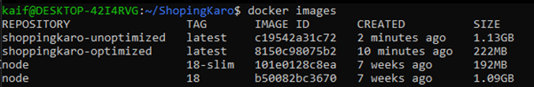
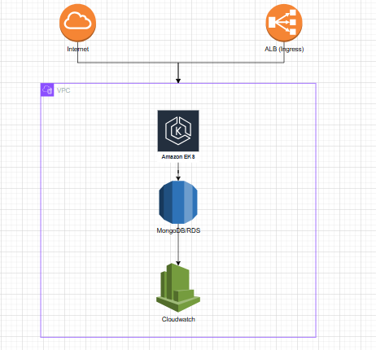

# ShopingKaro

ShopingKaro is a web application developed in Node.js that allows users to easily browse and shop for various products. With a user-friendly interface and a variety of features, ShopingKaro aims to provide a seamless online shopping experience.

## Table of Contents

- [Features](#features)
- [Tech Stack](#tech-stack)
- [Installation](#installation)
- [Optimization](#optimization)
- [Usage](#usage)
- [Contributing](#contributing)
- [License](#license)

## Features

- **User-friendly Interface:** Intuitive design for easy navigation and a pleasant user experience.
- **Product Browsing:** Browse through a wide range of products conveniently categorized for quick access.
- **Cart Management:** Add and remove items from the shopping cart with real-time updates.
- **Responsive Design:** ShopingKaro is optimized for various devices, ensuring a seamless experience on desktops, tablets, and mobile phones.

## Tech Stack

- **JavaScript (45.0%):** The primary programming language used for the functionality and interactivity of ShopingKaro.
- **EJS (31.8%):** Embedded JavaScript templates for dynamic content rendering.
- **CSS (12.5%):** Styling to enhance the visual appeal and user interface.
- **HTML (5.6%):** The backbone for structuring the web pages.
- **Pug (5.1%):** A templating engine for concise and readable HTML code.

## Installation

1. Clone the repository:

   ```bash
   git clone https://github.com/your-username/ShopingKaro.git

2. Install dependency:

   ```bash
   npm install

5. Setup MongoDB

   - Go to .env file
   - Create a database in MongoDb
   - Add a user and password in &lt;yourDBUser&gt; : &lt;password&gt; in below connection string.

   ```
   "mongodb+srv://<yourDBUser>:<password>@<yourDBcluster>/?retryWrites=true&w=majority",

4. Run :

   ```bash
   npm run start

Open your browser and visit http://localhost:3000 to access ShopingKaro.

Explore the website, add products to your cart, and enjoy a seamless shopping experience.

## Deliverables

### Optimization

- Switched to `node:18-slim` for a minimal base image  
- Used multi-stage builds to separate build and runtime layers  
- Used `.dockerignore` to exclude `node_modules`, logs, and unnecessary files  
- Used `npm ci` for faster, cache-friendly, and deterministic installs  
- Omitted dev dependencies using `NODE_ENV=production`  
- Used a non-root user for security

### Comparison with baseline image size



### How to build and run the image locally

```bash
# Build the Docker image
docker build -t shoppingkaro-optimized .

# Run the Docker container
docker run -p 3000:3000 optimized
```


## Usage

All the manifests are present in the k8s directory. For easy understanding, I've created different manifests in order to make it easy for beginners to understand easily.

### Apply k8s manifests

```bash
kubectl apply -f k8s/
```

### Access the Running Service - If using NodePort

```bash
kubectl get svc
# Then open in browser: http://<NodeIP>:<NodePort>
```

If using Ingress

```bash
kubectl get ingress
# Then open in browser: http://<Ingress Host or IP>
```

## Minimal Flow Diagram



## Justification of Architectural Choices

### Workload Types

1. **Node.js App**: Used `Deployment` for stateless, horizontally scalable services.  
2. **MongoDB**: Used `StatefulSet` to maintain persistent identity and stable storage.

### Networking and Scalability Decisions

1. Used `Service (ClusterIP)` for internal MongoDB access  
2. Used `Ingress` for external access to Node.js app  
3. Enabled `HorizontalPodAutoscaler (HPA)` for app scalability based on CPU usage

### Security Measures

1. Dockerfile runs as non-root, minimizes attack surface  
2. `.dockerignore` and no dev dependencies reduce vulnerabilities  
3. Kubernetes `Secrets` used for sensitive data (DB credentials, JWT secrets)  
4. MongoDB not exposed externally

### Challenges Faced and Resolutions

1. **MongoDB Connection Issue**  
   - **Issue**: MongoDB wouldn't connect due to missing DNS or incorrect credentials  
   - **Resolution**: Defined correct internal service name and injected credentials via `Secrets`

2. **Image Layer Caching Issue**  
   - **Issue**: Image layer caching wasn’t working  
   - **Resolution**: Re-ordered Dockerfile layers and used `npm ci`

3. **Liveness Probe Restarts**  
   - **Issue**: Liveness probe caused unnecessary restarts  
   - **Resolution**: Tuned probe parameters (`initialDelaySeconds`, `timeoutSeconds`, `failureThreshold`)

## AWS Cloud Deployment Readiness

### AWS Services

1. `EKS`: To run Kubernetes workloads  
2. `RDS` (Mongo-compatible or self-hosted on EC2): For MongoDB  
3. `S3`: For static assets and backup  
4. `ALB + Ingress Controller`: For external traffic routing  
5. `CloudWatch`: For centralized logging and monitoring

## Load Testing Strategy

### Tool Choice and Why

- Chose `k6` for its developer-friendly scripting in JavaScript, good CLI UX, and CI integration.

### Test Design

- Simulate 100 RPS with ramp-up and ramp-down  
- Test endpoints: `/api/products`, `/api/users/login`, `/api/orders`  
- Duration: 10 minutes with varying concurrency levels

### Metrics Monitored

- Response time (P95 latency)  
- Error rate  
- CPU/memory usage of pods  
- Throughput (requests per second)

### Scaling Decisions

- Based on peak CPU/memory, adjusted resource requests/limits  
- HPA thresholds configured to trigger additional replicas during high load  
- MongoDB storage size and IOPS benchmarked to avoid bottlenecks


## Contributing

If you'd like to contribute to ShopingKaro, please follow these guidelines:

- Fork the repository on GitHub.
- Clone your forked repository to your local machine.
- Create a new branch for your feature or bug fix.
- Make your changes and commit them with descriptive commit messages.
- Push your changes to your forked repository.
- Create a pull request to the main repository.

## License

This project is licensed under the MIT License. Feel free to use, modify, and distribute it as per the license terms.
